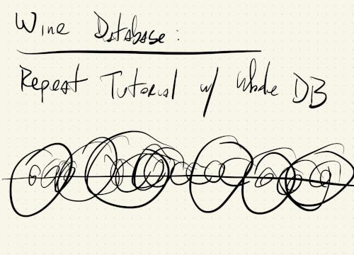
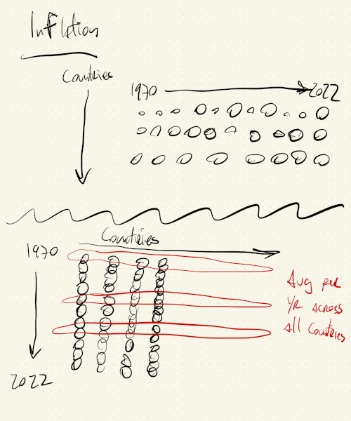
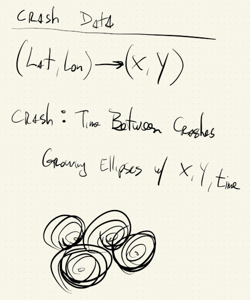

# HW04

## Wine Database:
Circles that map relationship between price of wine and its point rating.

X: Points  
Diameter: Price

---
## Global Inflation:
Circles to visualize different countries's inflation indexes between the years of 1970 - 2022.

White:  
X: Different Countries's inflation indexes  
Y: Years (1970 - 2022)  
Diameter: Relative inflation amount

Red:  
Y: Years (1970 - 2022)  
Diameter: Average inflation computed over all indexes for a given year

---
## Crash Database:
Animation that shows frequency of accidents, but using a scale of time of 1:3600 (1 sec in animation is 1 hour in real time).

X: Longitude of accident  
Y: Latitude of accident  
D: Grows and fades over 255 frames
